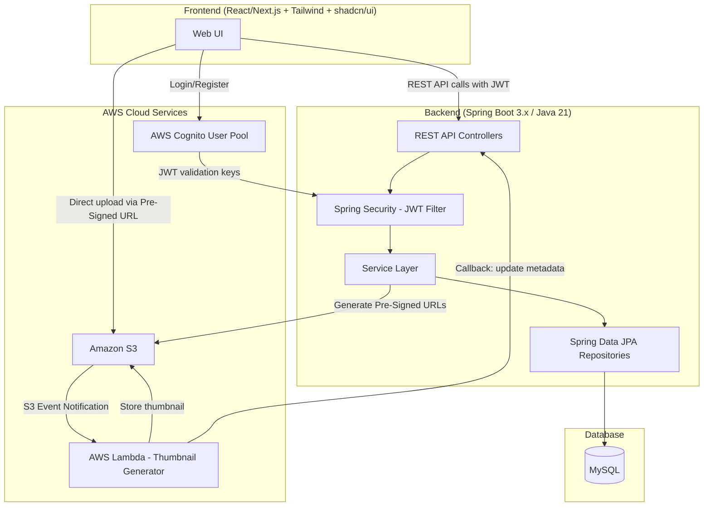
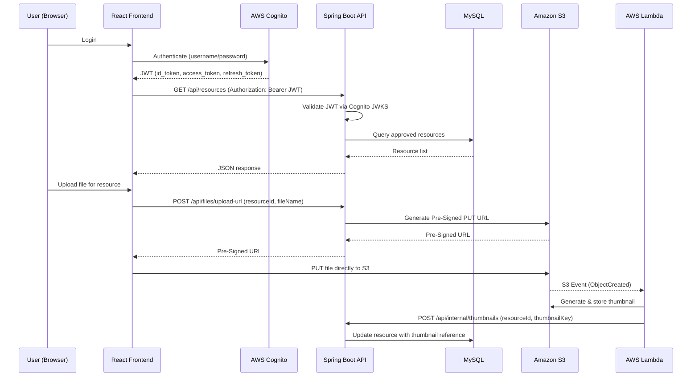
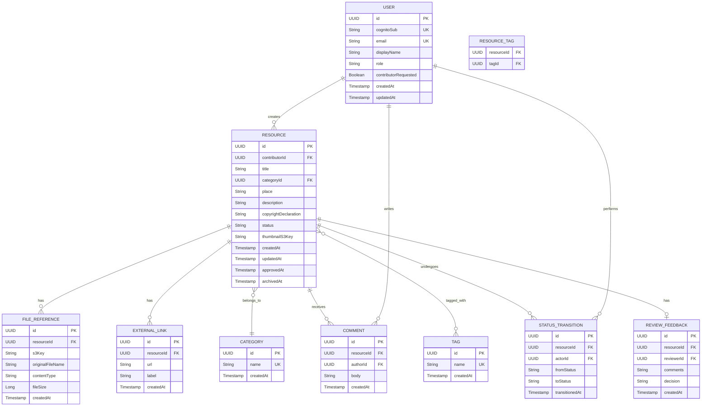
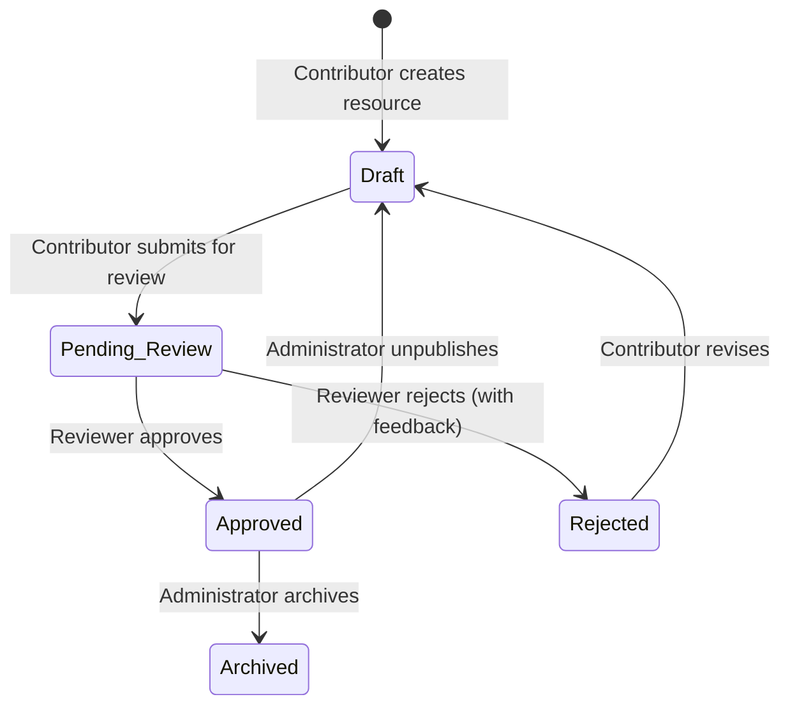
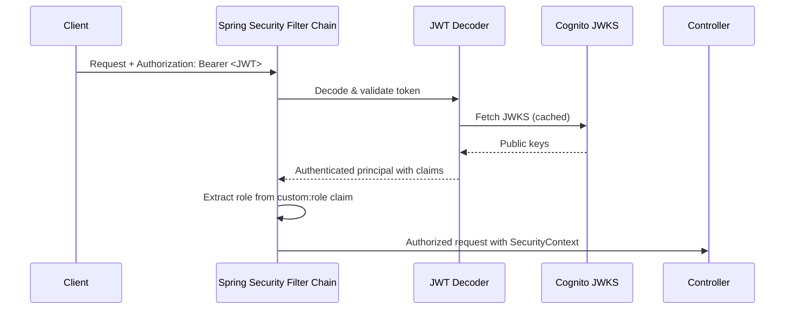
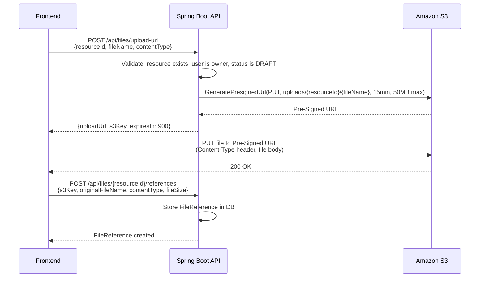
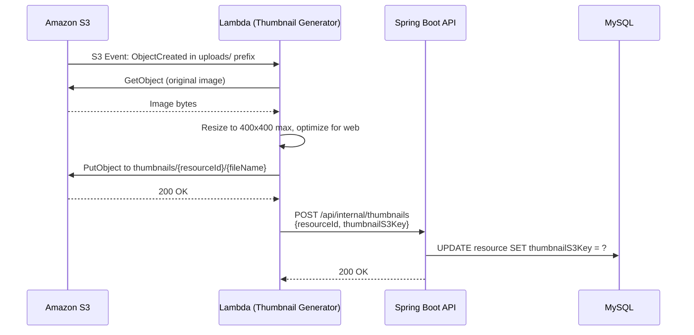

# Design Document: Heritage Resource Platform

## Overview

The Heritage Resource Platform is a community-driven web application for sharing, curating, and discovering cultural heritage resources. Contributors submit entries (images, stories, traditions, places, objects, educational materials) that pass through a moderated review workflow before becoming publicly visible. The system enforces role-based access control (Administrator, Reviewer, Contributor, Registered_Viewer) and integrates with AWS services for authentication (Cognito), file storage (S3), and asynchronous media processing (Lambda).

The platform follows a layered architecture: a React/Next.js frontend communicates with a Spring Boot 3.x REST API backend, which persists data in MySQL via Spring Data JPA and delegates authentication to AWS Cognito. File uploads bypass the backend entirely using S3 pre-signed URLs, and thumbnail generation is handled asynchronously by an S3-triggered Lambda function.

## Architecture

### High-Level System Architecture



### Component Interaction Flow



### Spring Boot Application Layers

```
┌─────────────────────────────────────────────────┐
│  Controllers (REST API)                         │
│  - ResourceController                           │
│  - ReviewController                             │
│  - FileController                               │
│  - UserController                               │
│  - CategoryController / TagController           │
│  - CommentController                            │
├─────────────────────────────────────────────────┤
│  Security Layer                                 │
│  - JwtAuthenticationFilter                      │
│  - SecurityConfig (role-based endpoint rules)   │
│  - CognitoJwtDecoder (prod) / MockJwt (local)  │
├─────────────────────────────────────────────────┤
│  Service Layer                                  │
│  - ResourceService                              │
│  - ReviewService                                │
│  - FileService (S3 pre-signed URL generation)   │
│  - AuthService (Cognito user management)        │
│  - SearchService                                │
│  - CommentService                               │
│  - CategoryService / TagService                 │
├─────────────────────────────────────────────────┤
│  Repository Layer (Spring Data JPA)             │
│  - ResourceRepository                           │
│  - ReviewRepository                             │
│  - FileReferenceRepository                      │
│  - CommentRepository                            │
│  - CategoryRepository / TagRepository           │
│  - StatusTransitionRepository                   │
├─────────────────────────────────────────────────┤
│  Database (MySQL)                               │
└─────────────────────────────────────────────────┘
```

## Components and Interfaces

### Backend REST API Endpoints

#### Authentication & Users (`/api/auth`, `/api/users`)

| Method | Path | Role | Description |
|--------|------|------|-------------|
| POST | `/api/auth/register` | Public | Register a new user (creates Cognito user with Registered_Viewer role) |
| POST | `/api/auth/login` | Public | Authenticate and receive Cognito tokens |
| POST | `/api/auth/logout` | Authenticated | Invalidate session / revoke token |
| GET | `/api/users/me` | Authenticated | Get current user profile |
| PUT | `/api/users/me` | Authenticated | Update current user profile |
| GET | `/api/users/pending-contributors` | Administrator | List users requesting Contributor status |
| POST | `/api/users/{userId}/grant-contributor` | Administrator | Grant Contributor role |
| POST | `/api/users/{userId}/revoke-contributor` | Administrator | Revoke Contributor role |

#### Resources (`/api/resources`)

| Method | Path | Role | Description |
|--------|------|------|-------------|
| POST | `/api/resources` | Contributor | Create a new draft resource |
| GET | `/api/resources/{id}` | Varies | Get resource detail (public for Approved, owner for Draft/Rejected, Admin for all) |
| PUT | `/api/resources/{id}` | Contributor (owner) | Update a draft resource |
| DELETE | `/api/resources/{id}` | Contributor (owner) | Delete a draft resource |
| POST | `/api/resources/{id}/submit` | Contributor (owner) | Submit draft for review |
| POST | `/api/resources/{id}/revise` | Contributor (owner) | Move rejected resource back to draft |
| GET | `/api/resources/mine` | Contributor | List contributor's own resources |

#### Review (`/api/reviews`)

| Method | Path | Role | Description |
|--------|------|------|-------------|
| GET | `/api/reviews/queue` | Reviewer, Administrator | Get pending review queue |
| POST | `/api/reviews/{resourceId}/approve` | Reviewer, Administrator | Approve a resource |
| POST | `/api/reviews/{resourceId}/reject` | Reviewer, Administrator | Reject a resource (requires feedback) |

#### Search & Browse (`/api/search`)

| Method | Path | Role | Description |
|--------|------|------|-------------|
| GET | `/api/search/resources` | Authenticated | Search/browse approved resources with filters |

Query parameters: `q` (text query), `categoryId`, `tagId`, `page`, `size` (default 20)

#### Files (`/api/files`)

| Method | Path | Role | Description |
|--------|------|------|-------------|
| POST | `/api/files/upload-url` | Contributor | Generate pre-signed upload URL |
| POST | `/api/files/{resourceId}/references` | Contributor | Register uploaded file reference on resource |
| DELETE | `/api/files/{resourceId}/references/{fileRefId}` | Contributor (owner) | Remove file reference from draft resource |

#### Comments (`/api/comments`)

| Method | Path | Role | Description |
|--------|------|------|-------------|
| POST | `/api/comments/{resourceId}` | Authenticated | Add comment to approved resource |
| GET | `/api/comments/{resourceId}` | Authenticated | Get paginated comments for resource |

#### Categories & Tags (`/api/categories`, `/api/tags`)

| Method | Path | Role | Description |
|--------|------|------|-------------|
| GET | `/api/categories` | Authenticated | List all categories |
| POST | `/api/categories` | Administrator | Create category |
| PUT | `/api/categories/{id}` | Administrator | Update category |
| GET | `/api/tags` | Authenticated | List all tags |
| POST | `/api/tags` | Administrator | Create tag |
| PUT | `/api/tags/{id}` | Administrator | Update tag |

#### Admin (`/api/admin`)

| Method | Path | Role | Description |
|--------|------|------|-------------|
| POST | `/api/admin/resources/{id}/archive` | Administrator | Archive an approved resource |
| POST | `/api/admin/resources/{id}/unpublish` | Administrator | Unpublish (move approved to draft) |
| GET | `/api/admin/resources/archived` | Administrator | List archived resources |

#### Internal (`/api/internal`)

| Method | Path | Role | Description |
|--------|------|------|-------------|
| POST | `/api/internal/thumbnails` | Lambda (API key) | Callback from Lambda to register thumbnail |


### Frontend Architecture (React/Next.js)

#### Tech Stack
- Framework: Next.js (App Router) with React 18+
- Styling: Tailwind CSS with custom "Cultural Heritage" theme
- Components: shadcn/ui for data tables, forms, dialogs, toasts
- State Management: React Query (TanStack Query) for server state, React Context for auth state
- Routing: Next.js App Router file-based routing

#### Design Theme Configuration
```
Colors:
  - Background: off-white (#FAFAF5 or similar warm off-white)
  - Primary: Slate/Navy (#1E293B slate-800, #334155 slate-700)
  - Accent: Warm amber (#B45309) for highlights and CTAs
  - Text: Slate-900 for body, Slate-600 for secondary
  
Typography:
  - Headings: Serif font (e.g., "Playfair Display" or "Merriweather") — museum-like, academic
  - Body: Sans-serif (e.g., "Inter" or system default) — clean, modern readability
```

#### Page Structure

| Route | Page | Access |
|-------|------|--------|
| `/` | Landing / Home (featured approved resources) | Public |
| `/login` | Login form | Public |
| `/register` | Registration form | Public |
| `/browse` | Browse & search approved resources | Authenticated |
| `/resources/[id]` | Resource detail view | Authenticated |
| `/contribute` | Contributor dashboard (my resources) | Contributor |
| `/contribute/new` | Create new resource form | Contributor |
| `/contribute/[id]/edit` | Edit draft resource | Contributor |
| `/review` | Review queue | Reviewer, Admin |
| `/review/[id]` | Review a specific resource | Reviewer, Admin |
| `/admin/users` | User management | Admin |
| `/admin/categories` | Category management | Admin |
| `/admin/tags` | Tag management | Admin |
| `/admin/archived` | Archived resources | Admin |
| `/profile` | User profile | Authenticated |

#### Key Frontend Components

- `AuthProvider` — wraps app, manages Cognito tokens, provides user context
- `ResourceCard` — card component for resource listings (thumbnail, title, category, tags)
- `ResourceForm` — form for creating/editing resources (shadcn/ui form with validation)
- `FileUploader` — handles pre-signed URL flow: request URL → PUT to S3 → register reference
- `SearchBar` — text search with category/tag filter dropdowns
- `ReviewPanel` — side-by-side resource view + approve/reject actions
- `CommentSection` — paginated comment list with add-comment form
- `DataTable` — shadcn/ui data table for admin views (users, categories, tags)
- `StatusBadge` — colored badge showing resource status
- `ProtectedRoute` — HOC/wrapper that checks role before rendering

## Data Models

### Entity Relationship Diagram



### JPA Entity Definitions

#### User Entity
```java
@Entity
@Table(name = "users")
public class User {
    @Id
    @GeneratedValue(strategy = GenerationType.UUID)
    private UUID id;

    @Column(unique = true, nullable = false)
    private String cognitoSub;

    @Column(unique = true, nullable = false)
    private String email;

    @Column(nullable = false)
    private String displayName;

    @Enumerated(EnumType.STRING)
    @Column(nullable = false)
    private UserRole role; // REGISTERED_VIEWER, CONTRIBUTOR, REVIEWER, ADMINISTRATOR

    private boolean contributorRequested;

    private Instant createdAt;
    private Instant updatedAt;
}
```

#### Resource Entity
```java
@Entity
@Table(name = "resources")
public class Resource {
    @Id
    @GeneratedValue(strategy = GenerationType.UUID)
    private UUID id;

    @ManyToOne(fetch = FetchType.LAZY)
    @JoinColumn(name = "contributor_id", nullable = false)
    private User contributor;

    @Column(nullable = false)
    private String title;

    @ManyToOne(fetch = FetchType.LAZY)
    @JoinColumn(name = "category_id", nullable = false)
    private Category category;

    private String place;

    @Column(columnDefinition = "TEXT")
    private String description;

    @Column(nullable = false)
    private String copyrightDeclaration;

    @Enumerated(EnumType.STRING)
    @Column(nullable = false)
    private ResourceStatus status; // DRAFT, PENDING_REVIEW, APPROVED, REJECTED, ARCHIVED

    @ManyToMany
    @JoinTable(name = "resource_tags",
        joinColumns = @JoinColumn(name = "resource_id"),
        inverseJoinColumns = @JoinColumn(name = "tag_id"))
    private Set<Tag> tags = new HashSet<>();

    @OneToMany(mappedBy = "resource", cascade = CascadeType.ALL, orphanRemoval = true)
    private List<FileReference> fileReferences = new ArrayList<>();

    @OneToMany(mappedBy = "resource", cascade = CascadeType.ALL, orphanRemoval = true)
    private List<ExternalLink> externalLinks = new ArrayList<>();

    private String thumbnailS3Key;
    private Instant createdAt;
    private Instant updatedAt;
    private Instant approvedAt;
    private Instant archivedAt;
}
```

#### ResourceStatus Enum and State Machine
```java
public enum ResourceStatus {
    DRAFT,
    PENDING_REVIEW,
    APPROVED,
    REJECTED,
    ARCHIVED;

    private static final Map<ResourceStatus, Set<ResourceStatus>> ALLOWED_TRANSITIONS = Map.of(
        DRAFT, Set.of(PENDING_REVIEW),
        PENDING_REVIEW, Set.of(APPROVED, REJECTED),
        APPROVED, Set.of(ARCHIVED, DRAFT),
        REJECTED, Set.of(DRAFT),
        ARCHIVED, Set.of()
    );

    public boolean canTransitionTo(ResourceStatus target) {
        return ALLOWED_TRANSITIONS.getOrDefault(this, Set.of()).contains(target);
    }
}
```

### Data Deletion Strategy

- **DRAFT resources (Hard Delete):** When a Contributor performs a `DELETE` operation on a Draft resource, the system executes a physical removal from the MySQL database, including cascading deletion of all associated `FileReference` and `ExternalLink` records. The corresponding S3 objects should also be deleted.
- **APPROVED resources (Soft Delete via Archival):** Administrators cannot hard-delete approved resources. They must use the `ARCHIVED` status (a state change, not physical deletion) to hide the resource from public view. This preserves data integrity and audit trails for cultural heritage content.

### Resource Status State Machine



### Allowed Transitions Table

| From | To | Actor | Notes |
|------|----|-------|-------|
| (new) | Draft | Contributor | Resource creation |
| Draft | Pending_Review | Contributor (owner) | Submit for review; requires title, category, copyright |
| Pending_Review | Approved | Reviewer / Admin | Approval |
| Pending_Review | Rejected | Reviewer / Admin | Rejection; feedback required |
| Rejected | Draft | Contributor (owner) | Revision |
| Approved | Archived | Administrator | Archival |
| Approved | Draft | Administrator | Unpublish; notifies contributor |


## AWS Infrastructure

### Cognito User Pool

- User Pool with email as primary sign-in attribute
- Custom attribute `custom:role` to store platform role (REGISTERED_VIEWER, CONTRIBUTOR, REVIEWER, ADMINISTRATOR)
- App Client configured for `USER_PASSWORD_AUTH` flow (for API-based login)
- Token validity: access token 1 hour, refresh token 30 days
- Spring Boot acts as a Resource Server, validating JWTs using Cognito's JWKS endpoint (`/.well-known/jwks.json`)

### S3 Bucket Configuration

- Single bucket: `heritage-resources-{env}` with prefix-based organization:
  - `uploads/{resourceId}/{fileName}` — original uploaded files
  - `thumbnails/{resourceId}/{fileName}` — generated thumbnails
- CORS configuration allowing PUT from the frontend origin (for pre-signed URL uploads)
- Bucket policy restricting direct public access; all reads via pre-signed URLs
- Lifecycle rule: optional cleanup of orphaned uploads after 30 days

### Lambda Thumbnail Generator

- Runtime: Python 3.12 or Node.js 20
- Trigger: S3 Event Notification on `ObjectCreated` events in the `uploads/` prefix
- Behavior: reads the uploaded image, generates a 400x400 max thumbnail, stores it under `thumbnails/` prefix
- Callback: invokes the backend's internal API (`POST /api/internal/thumbnails`) with the resource ID and thumbnail S3 key
- IAM Role: read from `uploads/`, write to `thumbnails/`, invoke API Gateway or direct HTTP to backend

### Infrastructure as Code (Terraform)

Key resources to provision:
- `aws_cognito_user_pool` + `aws_cognito_user_pool_client`
- `aws_s3_bucket` with CORS, lifecycle, and event notification configuration
- `aws_lambda_function` with S3 trigger and IAM role
- `aws_iam_role` and `aws_iam_policy` for Lambda execution

## Local Development Setup

### docker-compose.yml Services

```yaml
services:
  mysql:
    image: mysql:8.0
    environment:
      MYSQL_ROOT_PASSWORD: rootpass
      MYSQL_DATABASE: heritage
    ports:
      - "3306:3306"

  localstack:
    image: localstack/localstack
    environment:
      SERVICES: s3
      DEFAULT_REGION: us-east-1
    ports:
      - "4566:4566"
```

### Spring Boot Profiles

#### application.yml (common)
```yaml
spring:
  jpa:
    hibernate:
      ddl-auto: validate
    open-in-view: false
  jackson:
    default-property-inclusion: non_null
```

#### application-local.yml
```yaml
spring:
  datasource:
    url: jdbc:mysql://localhost:3306/heritage
    username: root
    password: rootpass

aws:
  s3:
    endpoint: http://localhost:4566
    bucket: heritage-resources-local
    region: us-east-1

security:
  auth-mode: mock  # Bypasses Cognito JWT validation
```

#### application-dev.yml
```yaml
spring:
  datasource:
    url: jdbc:mysql://${RDS_ENDPOINT}:3306/heritage
    username: ${RDS_USERNAME}
    password: ${RDS_PASSWORD}

aws:
  cognito:
    user-pool-id: ${COGNITO_USER_POOL_ID}
    region: ${AWS_REGION}
  s3:
    bucket: heritage-resources-dev
    region: ${AWS_REGION}
```

### Local Auth Strategy

- **Unit/Integration Tests**: Use Spring Security's `@WithMockUser(roles = "CONTRIBUTOR")` annotation
- **Local Profile (Postman testing)**: Accept a dummy `Authorization: Bearer local-dev-token` header. A custom `LocalAuthFilter` extracts a `X-Mock-User-Role` header to simulate different roles
- **Dev/Prod Profile**: Full Cognito JWT validation via Spring Security OAuth2 Resource Server

## Security Design

### JWT Validation Flow



### Role-Based Access Control Matrix

| Endpoint Group | REGISTERED_VIEWER | CONTRIBUTOR | REVIEWER | ADMINISTRATOR |
|---------------|:-:|:-:|:-:|:-:|
| Browse/Search resources | ✓ | ✓ | ✓ | ✓ |
| View resource detail | ✓ | ✓ | ✓ | ✓ |
| Comment on resources | ✓ | ✓ | ✓ | ✓ |
| Create/edit/delete own resources | | ✓ | | |
| Submit resource for review | | ✓ | | |
| Review queue / approve / reject | | | ✓ | ✓ |
| Manage categories & tags | | | | ✓ |
| Manage users / grant roles | | | | ✓ |
| Archive / unpublish resources | | | | ✓ |

### Security Configuration (Spring Security)
```java
@Configuration
@EnableWebSecurity
public class SecurityConfig {

    @Bean
    public SecurityFilterChain filterChain(HttpSecurity http) throws Exception {
        http
            .csrf(csrf -> csrf.disable())
            .sessionManagement(sm -> sm.sessionCreationPolicy(SessionCreationPolicy.STATELESS))
            .authorizeHttpRequests(auth -> auth
                .requestMatchers("/api/auth/register", "/api/auth/login").permitAll()
                .requestMatchers("/api/admin/**").hasRole("ADMINISTRATOR")
                .requestMatchers("/api/reviews/**").hasAnyRole("REVIEWER", "ADMINISTRATOR")
                .requestMatchers(HttpMethod.POST, "/api/resources").hasRole("CONTRIBUTOR")
                .requestMatchers(HttpMethod.PUT, "/api/resources/**").hasRole("CONTRIBUTOR")
                .requestMatchers(HttpMethod.DELETE, "/api/resources/**").hasRole("CONTRIBUTOR")
                .requestMatchers("/api/resources/*/submit").hasRole("CONTRIBUTOR")
                .requestMatchers("/api/files/upload-url").hasRole("CONTRIBUTOR")
                .requestMatchers("/api/internal/**").hasRole("SYSTEM")
                .anyRequest().authenticated()
            )
            .oauth2ResourceServer(oauth2 -> oauth2
                .jwt(jwt -> jwt.jwtAuthenticationConverter(jwtAuthenticationConverter())));
        return http.build();
    }

    /**
     * Critical: AWS Cognito JWTs store the role in a custom claim "custom:role"
     * (e.g., "custom:role": "CONTRIBUTOR"). Spring Security's hasRole() expects
     * a "ROLE_" prefix. This converter bridges the two by reading from the
     * custom claim and adding the required prefix automatically.
     */
    @Bean
    public JwtAuthenticationConverter jwtAuthenticationConverter() {
        JwtGrantedAuthoritiesConverter grantedAuthoritiesConverter = new JwtGrantedAuthoritiesConverter();
        grantedAuthoritiesConverter.setAuthoritiesClaimName("custom:role");
        grantedAuthoritiesConverter.setAuthorityPrefix("ROLE_");

        JwtAuthenticationConverter jwtAuthenticationConverter = new JwtAuthenticationConverter();
        jwtAuthenticationConverter.setJwtGrantedAuthoritiesConverter(grantedAuthoritiesConverter);
        return jwtAuthenticationConverter;
    }
}
```

## File Upload Flow

### Pre-Signed URL Upload Sequence



## Async Media Processing Flow

### S3 Event → Lambda → Thumbnail



### Processing Considerations
- Lambda timeout: 30 seconds (sufficient for image resizing)
- Non-image files (PDFs, documents): Lambda skips processing, no thumbnail generated
- Error handling: Lambda logs failures to CloudWatch; resource remains without thumbnail (non-blocking)
- Idempotency: re-uploading the same file triggers a new thumbnail generation, overwriting the previous one

