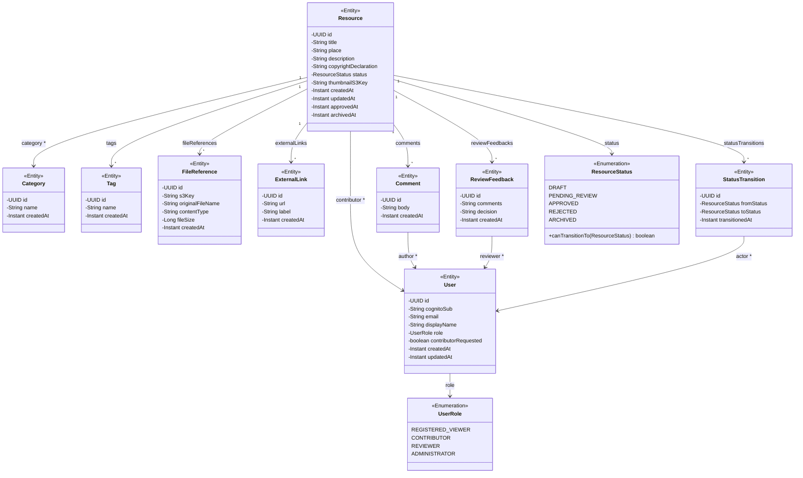
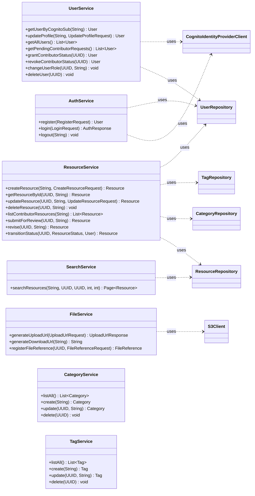
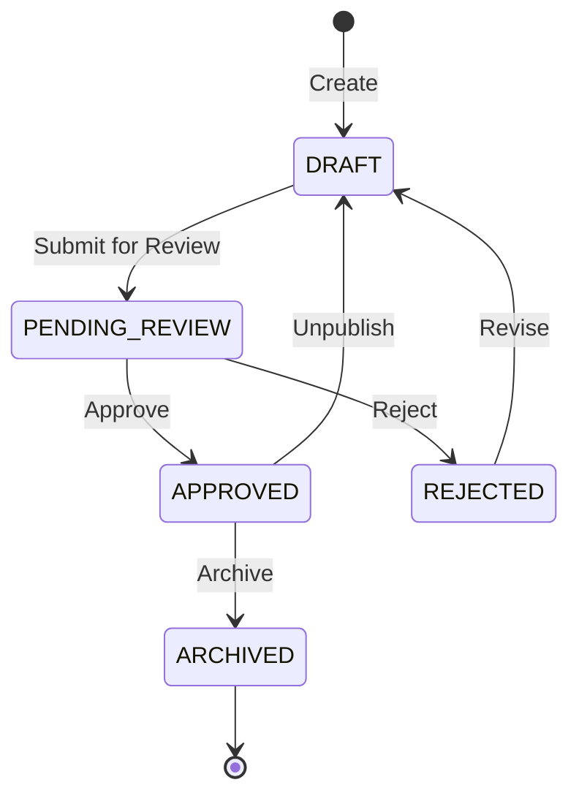

# Class Diagram — Heritage Resource Platform

## Entity Relationship Diagram



## Service Layer



## Controller Layer (REST API)

```mermaid
classDiagram
    direction LR

    class AuthController {
        <<RestController /api/auth>>
        +POST /register
        +POST /login
        +POST /logout
    }

    class ResourceController {
        <<RestController /api/resources>>
        +POST /
        +GET /{id}
        +PUT /{id}
        +DELETE /{id}
        +POST /{id}/submit
        +POST /{id}/revise
        +GET /mine
    }

    class UserController {
        <<RestController /api/users>>
        +GET /me
        +PUT /me
        +GET /all
        +GET /pending-contributors
        +POST /{id}/grant-contributor
        +POST /{id}/revoke-contributor
        +PUT /{id}/role
        +DELETE /{id}
    }

    class SearchController {
        <<RestController /api/search>>
        +GET /resources
    }

    class FileController {
        <<RestController /api/files>>
        +POST /upload-url
        +POST /{resourceId}/references
    }

    class CategoryController {
        <<RestController /api/categories>>
        +GET /
        +POST /
        +PUT /{id}
        +DELETE /{id}
    }

    class TagController {
        <<RestController /api/tags>>
        +GET /
        +POST /
        +PUT /{id}
        +DELETE /{id}
    }

    AuthController ..> AuthService
    ResourceController ..> ResourceService
    ResourceController ..> FileService
    UserController ..> UserService
    SearchController ..> SearchService
    FileController ..> FileService
    CategoryController ..> CategoryService
    TagController ..> TagService
```

## Resource Status State Machine


