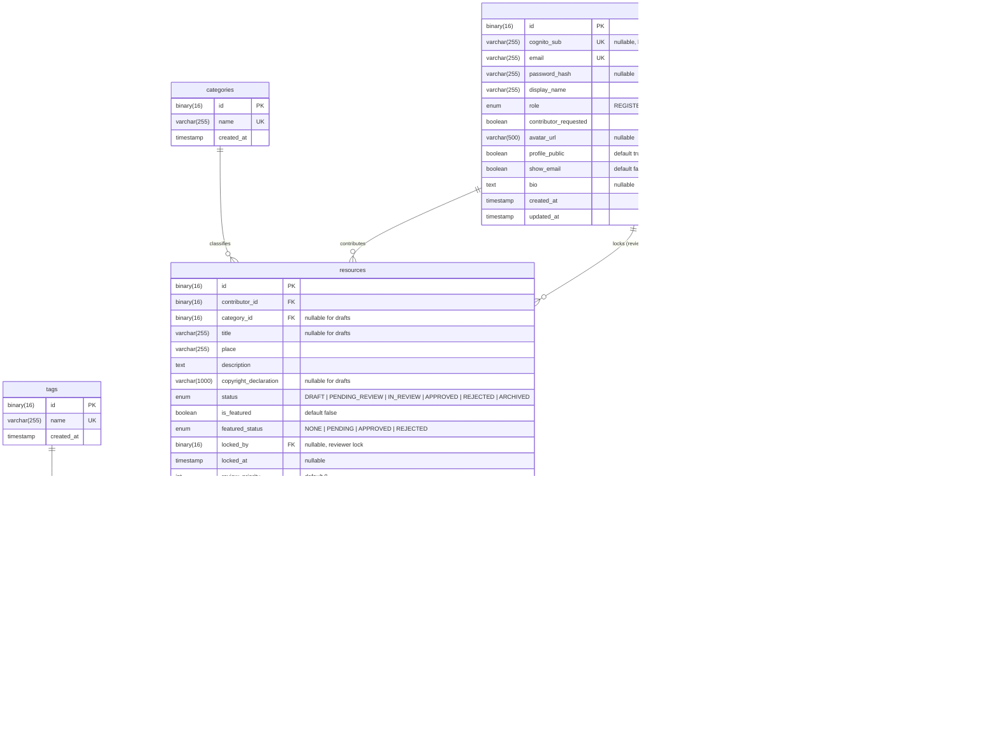

# Database ER Diagram — Heritage Resource Platform

```mermaid
erDiagram
    users {
        binary(16) id PK
        varchar(255) cognito_sub UK "nullable, legacy"
        varchar(255) email UK
        varchar(255) password_hash "nullable"
        varchar(255) display_name
        enum role "REGISTERED_VIEWER | CONTRIBUTOR | REVIEWER | ADMINISTRATOR"
        boolean contributor_requested
        varchar(500) avatar_url "nullable"
        boolean profile_public "default true"
        boolean show_email "default false"
        text bio "nullable"
        timestamp created_at
        timestamp updated_at
    }

    categories {
        binary(16) id PK
        varchar(255) name UK
        timestamp created_at
    }

    tags {
        binary(16) id PK
        varchar(255) name UK
        timestamp created_at
    }

    resources {
        binary(16) id PK
        binary(16) contributor_id FK
        binary(16) category_id FK "nullable for drafts"
        varchar(255) title "nullable for drafts"
        varchar(255) place
        text description
        varchar(1000) copyright_declaration "nullable for drafts"
        enum status "DRAFT | PENDING_REVIEW | IN_REVIEW | APPROVED | REJECTED | ARCHIVED"
        boolean is_featured "default false"
        enum featured_status "NONE | PENDING | APPROVED | REJECTED"
        binary(16) locked_by FK "nullable, reviewer lock"
        timestamp locked_at "nullable"
        int review_priority "default 0"
        varchar(255) thumbnail_s3_key
        timestamp created_at
        timestamp updated_at
        timestamp approved_at
        timestamp archived_at
    }

    resource_tags {
        binary(16) resource_id FK
        binary(16) tag_id FK
    }

    file_references {
        binary(16) id PK
        binary(16) resource_id FK
        varchar(255) s3_key
        varchar(255) original_file_name
        varchar(255) content_type
        bigint file_size
        timestamp created_at
    }

    external_links {
        binary(16) id PK
        binary(16) resource_id FK
        varchar(255) url
        varchar(255) label
        timestamp created_at
    }

    comments {
        binary(16) id PK
        binary(16) resource_id FK
        binary(16) author_id FK
        text body
        boolean anonymous "default false"
        timestamp created_at
    }

    review_feedback {
        binary(16) id PK
        binary(16) resource_id FK
        binary(16) reviewer_id FK
        text comments
        varchar(255) decision
        timestamp created_at
    }

    status_transitions {
        binary(16) id PK
        binary(16) resource_id FK
        binary(16) actor_id FK
        enum from_status
        enum to_status
        timestamp transitioned_at
    }

    flyway_schema_history {
        int installed_rank PK
        varchar(50) version
        varchar(200) description
        varchar(20) type
        varchar(1000) script
        int checksum
        varchar(100) installed_by
        timestamp installed_on
        int execution_time
        boolean success
    }

    users ||--o{ resources : "contributes"
    users ||--o{ resources : "locks (reviewer)"
    categories ||--o{ resources : "classifies"
    resources ||--o{ resource_tags : "has"
    tags ||--o{ resource_tags : "applied to"
    resources ||--o{ file_references : "has"
    resources ||--o{ external_links : "has"
    resources ||--o{ comments : "has"
    resources ||--o{ review_feedback : "has"
    resources ||--o{ status_transitions : "tracks"
    users ||--o{ comments : "authors"
    users ||--o{ review_feedback : "reviews"
    users ||--o{ status_transitions : "performs"
```
